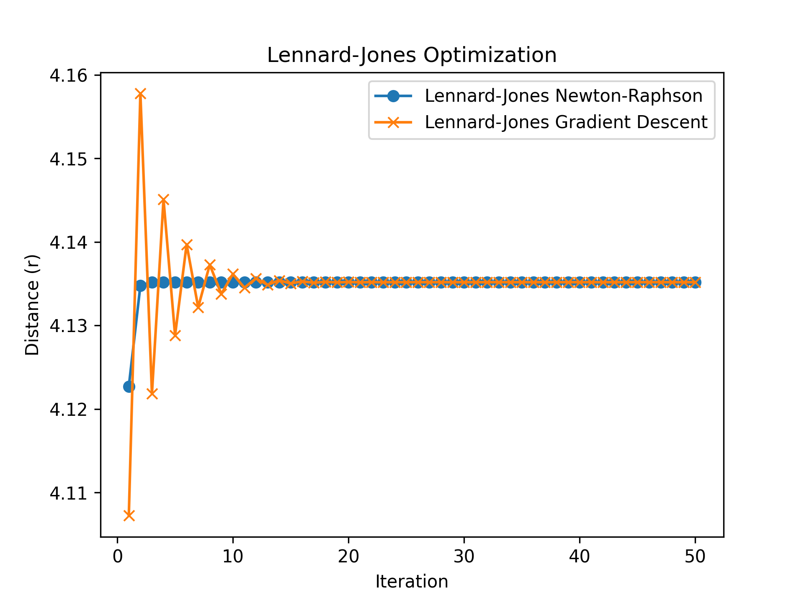
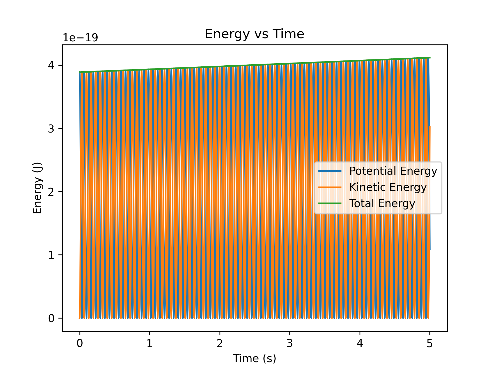
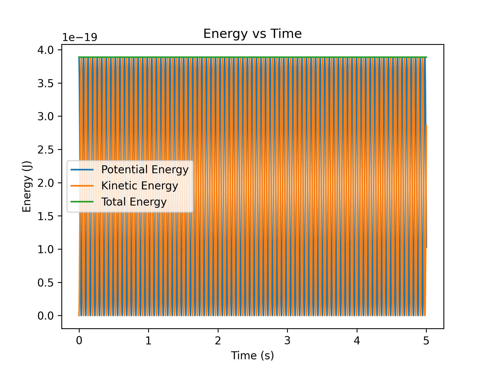
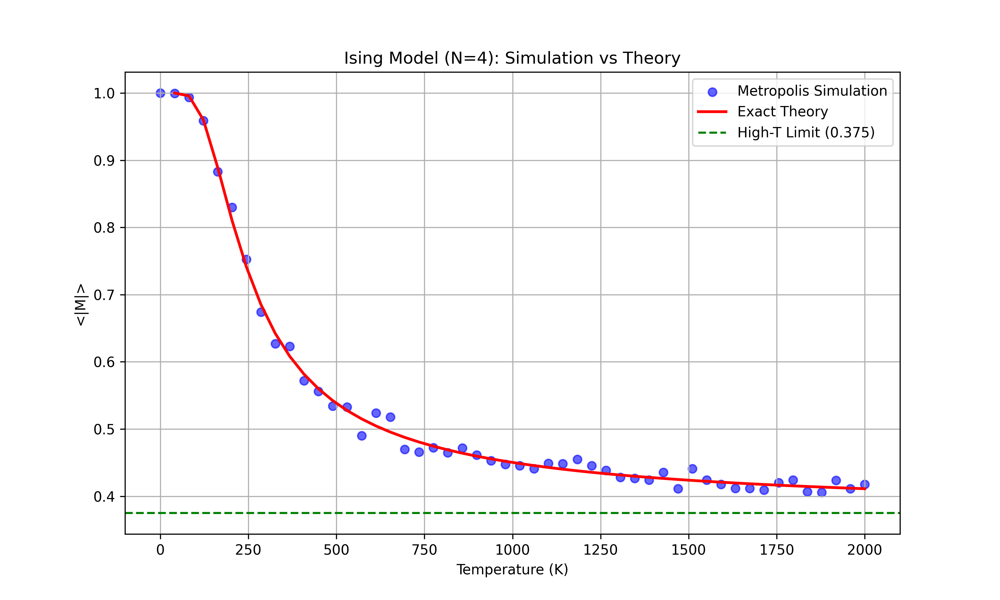

# CH40208-Exercise

## Introduction

This repository contains a collection of exercises developed during the self-study of **Computational Chemistry**. The content follows the curriculum of the **CH40208** online resource, covering topics from basic NumPy skills to fundamental molecular modeling.

---
 

## Course Topics

### ✅ Topics Covered
#### **Module 1**: Basic NumPy and Matplotlib
<<<<<<< HEAD

 

---
=======
>>>>>>> fac6d1c (update the READ.md)
#### **Module 2**: Geometry Optimisation & Potential Energy Surfaces (PES)
*    Gradient Descent Method
*    The Newton-Raphson Method
*    Harmonic Potential and Lennard-Jones Potential
<<<<<<< HEAD

  
   
  <em><b>Figure 1:</b> Convergence comparison between Newton-Raphson (blue) and Gradient Descent (orange).</em>

 

---

#### **Module 3**: Molecular Dynamics and Monte Carlo Simulation
*    Euler’s Method and The Velocity Verlet Method
<table style="width: 100%; text-align: center;">
  <tr>
    <th style="width: 50%;">Euler Method (Energy Not Conserved)</th>
    <th style="width: 50%;">Velocity Verlet (Energy Conserved)</th>
  </tr>
  <tr>
    <td></td>
    <td></td>
  </tr>
  <tr>
    <td><em>Note the upward drift in total energy (green line) due to integration error.</em></td>
    <td><em>Total energy remains stable, demonstrating a symplectic integrator.</em></td>
  </tr>
</table>

*    The Metropolis Algorithm

  
   
  <em><b>Figure 2:</b> Metropolis simulation results (dots) plotted against the exact theoretical solution (line).</em>

 

---
=======
#### **Module 3**: Molecular Dynamics and Monte Carlo Simulation
*    Euler’s Method and The Velocity Verlet Method
*    The Metropolis Algorithm
>>>>>>> fac6d1c (update the READ.md)

### ⏳ Topics To Be Covered
#### **Module 4**: Vectors and Matrices
#### **Module 5**: Adanced Coursework Notebooks
<<<<<<< HEAD

---
 
=======
>>>>>>> fac6d1c (update the READ.md)

## Environment & Libraries
To run the notebooks in this repository, you will need:
- **Python 3.x**
- **Core Libraries**: `NumPy`, `Matplotlib`, `SciPy`

---
 

## References
- **Course Site**: [CH40208 Topics in Computational Chemistry](https://pythoninchemistry.org/ch40208/introduction/about_this_book.html)